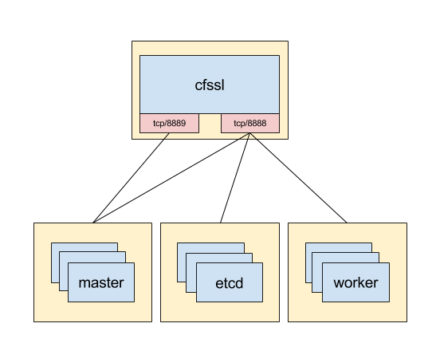

# cfssl

The `cfssl` server exposes two services:
- cfssl api on tcp/8888 (secured by standard cfssl tokens)
- http on tcp/8889 (secured by basic auth)

The yellow boxes in the diagram below are meant show what kind of network access should be allowed for the various nodes (eg. security groups in AWS).

All nodes can retrieve the CA certificate and request a new node certificate from cfssl on port 8888. Each uses a different auth token / profile which is controlled by the cfssl server. The certificates have a lifetime of a week and are rotated daily, by default.

Additionally, masters can retrieve the kubernetes signing key from the cfssl server on port 8889.

Rotating the certificate triggers a restart of the dependent services (`etcd-member`, `kubelet`, `apiserver`, `controller-manager`).
